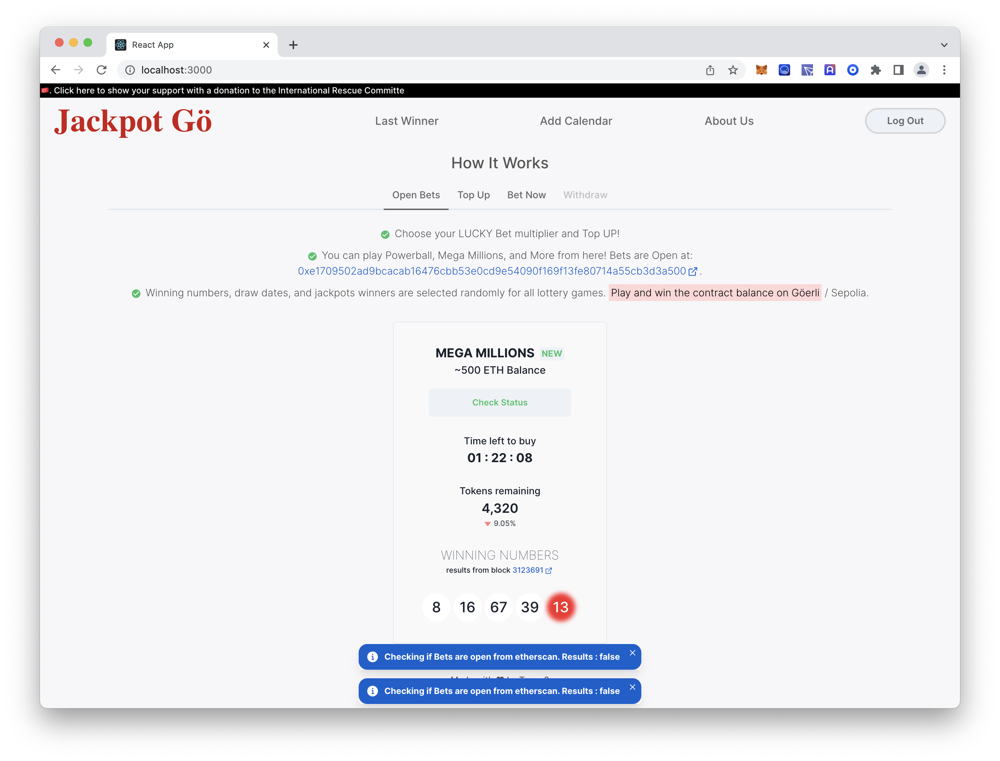
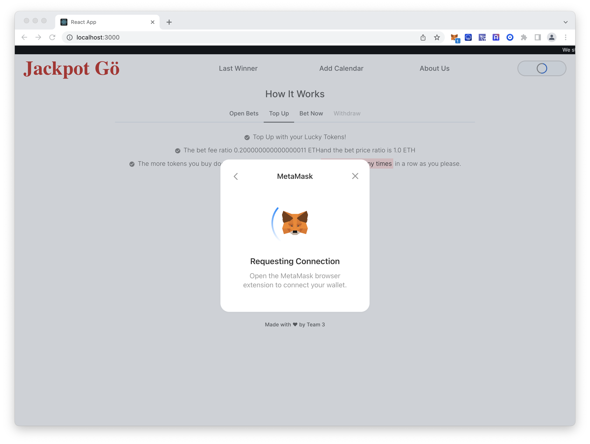
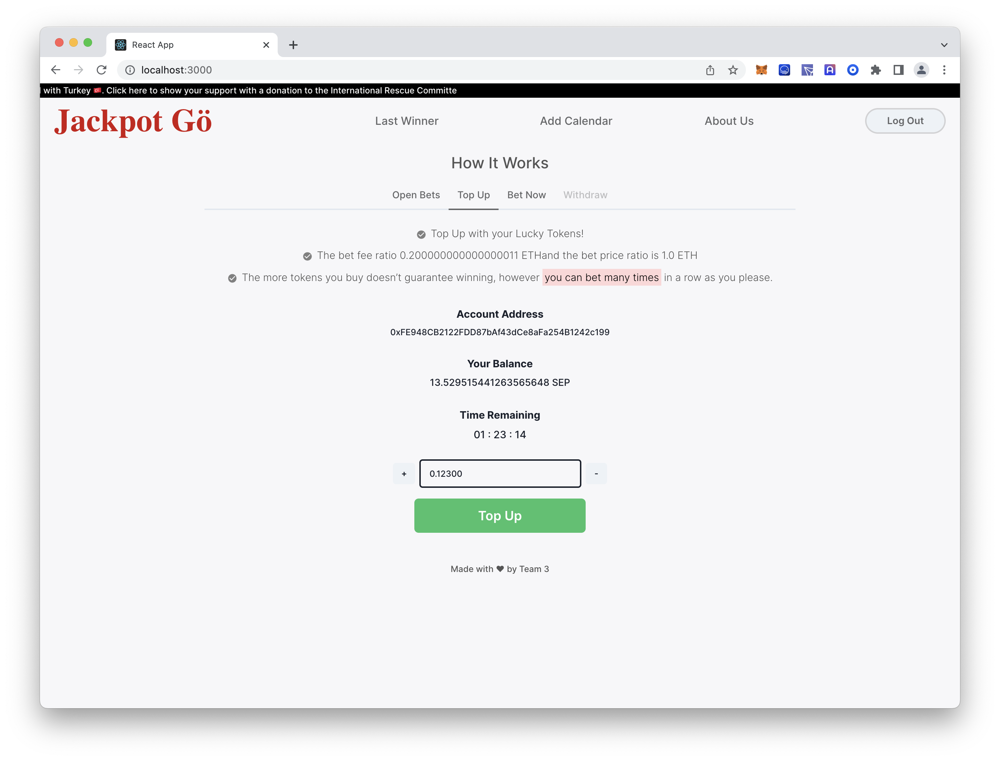

# Available Scripts

In the project directory, you can run:

### `npm start`

Runs the app in the development mode.\
Open [http://localhost:3000](http://localhost:3000) to view it in the browser.

### `npm test`

Launches the test runner in the interactive watch mode.\
See the section about [running tests](https://facebook.github.io/create-react-app/docs/running-tests) for more information.

### `npm run build`

Builds the app for production to the `build` folder.\
It correctly bundles React in production mode and optimizes the build for the best performance.

## Screen Shots

Toast messages that give check the open bet status on chain.

Connect with metamask

Top up page

Respisive view for mobile

Due to goerli's high transaction fees, deployed to Sepoli currently. [Lottery Contract](https://sepolia.etherscan.io/address/0x921ffd1c2471b153fbbf374e6887a662219b2dfc) and [Lottery Token](https://sepolia.etherscan.io/address/0x056f11d041441368D07549D07fEd7d7177272596#code).
