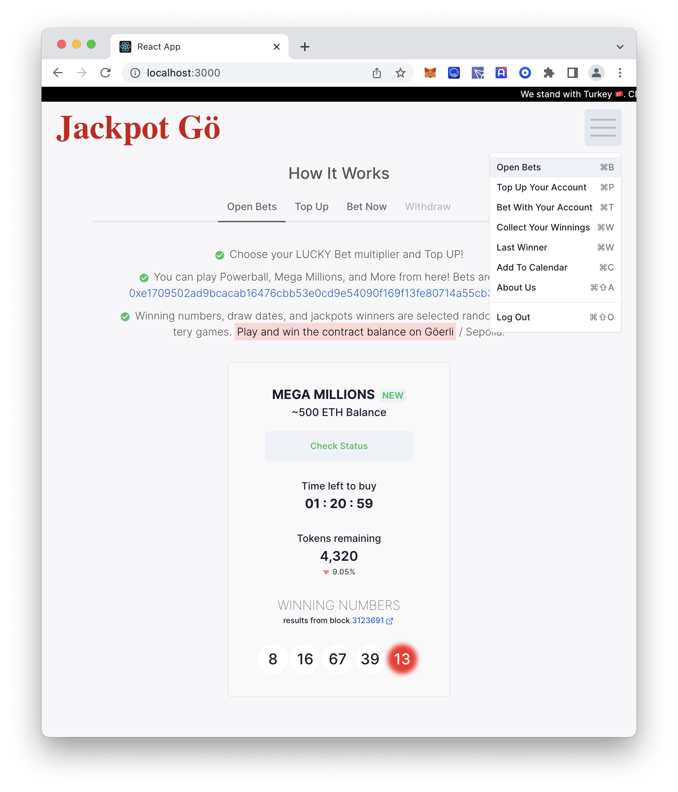

# Available Scripts

In the project directory, you can run:

### `npm start`

Runs the app in the development mode.\
Open [http://localhost:3000](http://localhost:3000) to view it in the browser.

### `npm test`

Launches the test runner in the interactive watch mode.\
See the section about [running tests](https://facebook.github.io/create-react-app/docs/running-tests) for more information.

### Deploy versions

Since some deploys are failing

Here is a previous deploy: https://jackpot-n04t4cnzz-mmsaki.vercel.app/

## Screen Shots

Toast messages that give check the open bet status on chain.

Connect with metamask

Top up page

Resposive view for mobile

Due to goerli's high transaction fees, deployed to Sepoli currently. [Lottery Contract](https://sepolia.etherscan.io/address/0x921ffd1c2471b153fbbf374e6887a662219b2dfc) and [Lottery Token](https://sepolia.etherscan.io/address/0x056f11d041441368D07549D07fEd7d7177272596#code).

## Designs

- [Figma Design](https://www.figma.com/file/hFoDY2IaAAojjyK8WSGb5O/Untitled?node-id=3%3A2&t=SZqZ6r3b0XDR6aJc-1)
